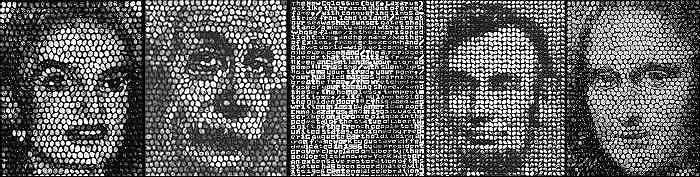
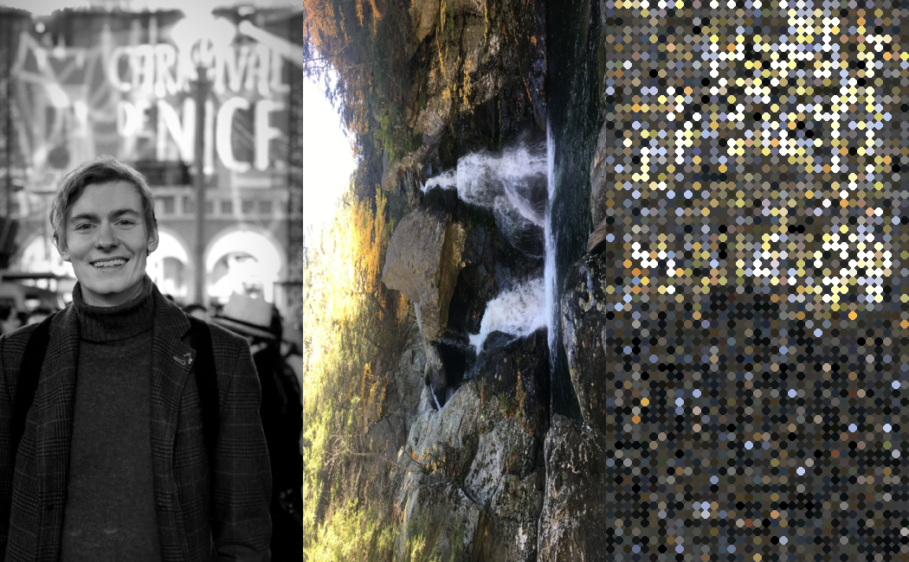
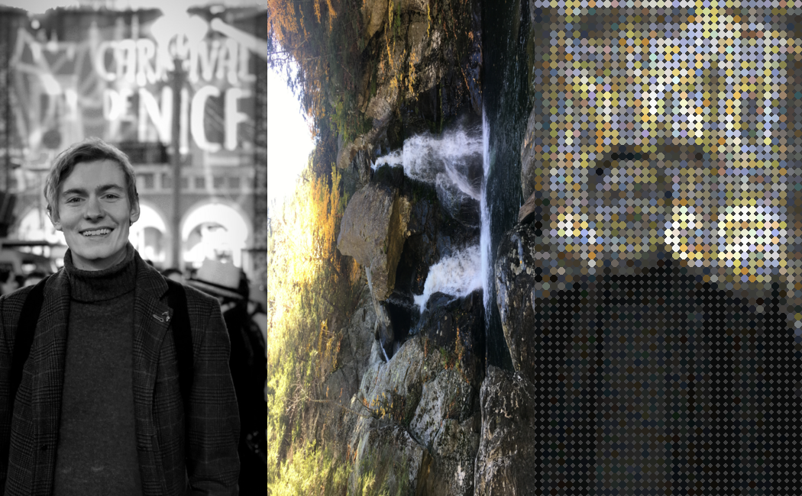
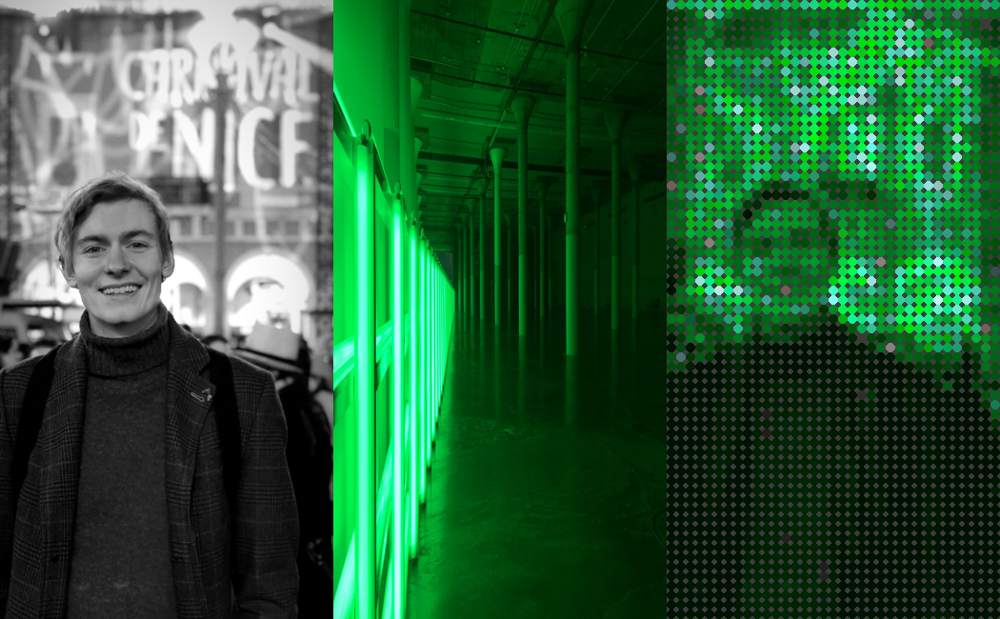
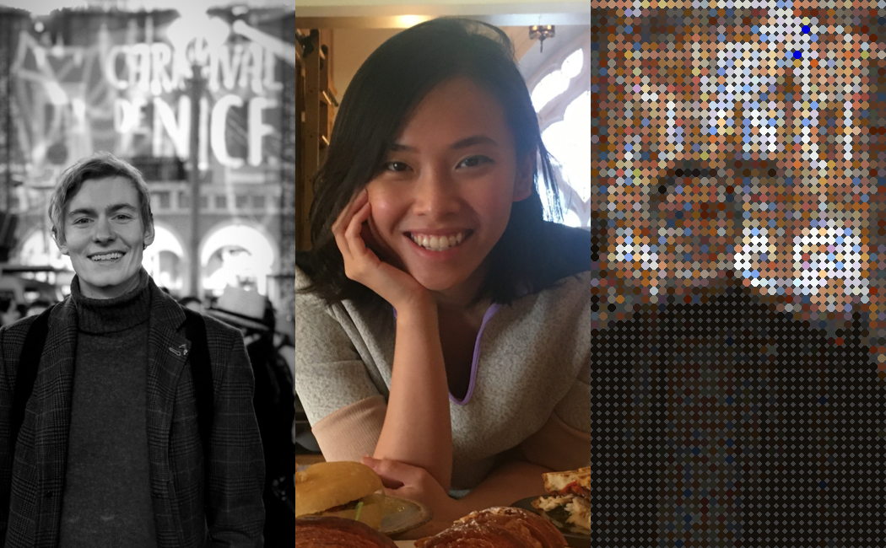
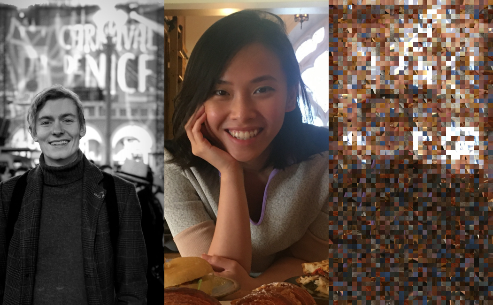
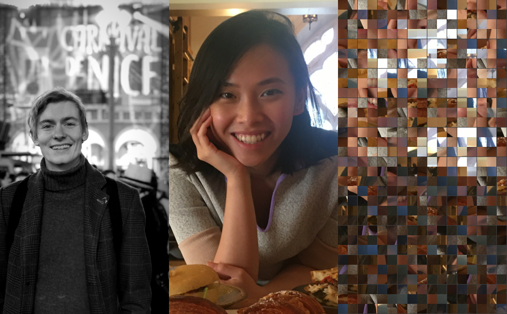
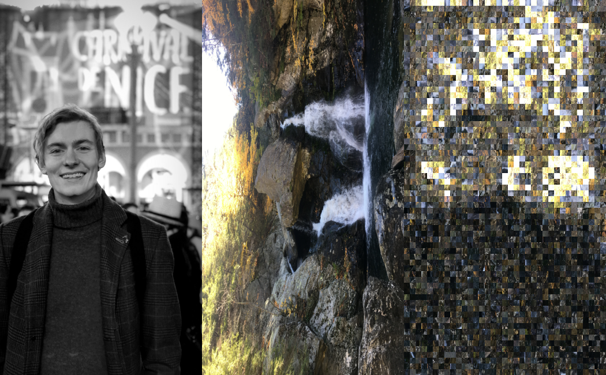
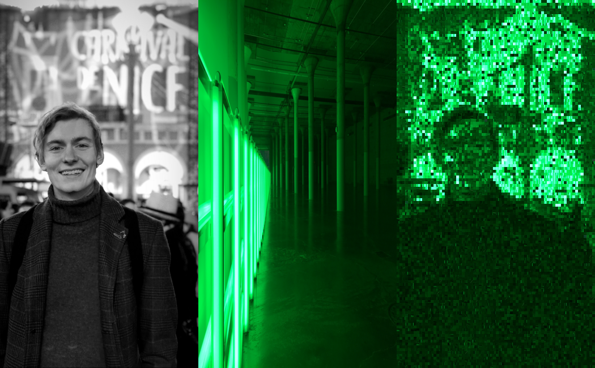
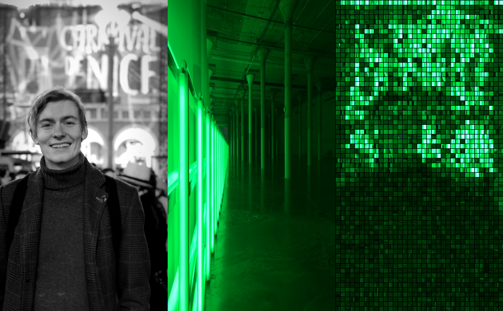

# ReKnowlton

## MIT Media Lab - Recreating the Past - Class 6: Ken Knowlton & Lillian Schwartz

The MIT Media Lab class - Recreating the Past - explores a number of influential artists who have, over the past century, added their own unique perspective on computational art. Each week focuses on a new artist and through exploring their view point and recreating their artworks I hope to gain a valuable window into their thought processes, helping me learn how to express my own opinions through computational art. 

## Ken Knowlton

This week covered two artists: Ken Knowlton and Lillian Schwartz where the focus was on understanding pixels and how they can manipulated. Utilizing operations such as erosion and dilation and the mapping of pixel wise features such as brightness and color, we can produce a wide range of artworks from animations to mosaics.

I chose to reproduce the essence of Ken Knowlton's mosaic pieces where he would take an image and recreate it using ordinary objects such as dominoes, broken ceramics or shells. Instead of utilizing physical objects however I decided to approach this as a more general problem - given two images, can we produce a mosaic of a target image utilizing the pixels from the source image?

In doing so this create a sort of mosaic framework which can be applied to many different styles by varying the source image.

## Assorted Mosaics

### Original Examples

Below are some examples of Ken's works.
<figure>

 <figcaption>Ken Knowlton Original Mosaics</figcaption>
</figure>
#### Process

Instead of picking a single image to reproduced I decided to write an algorithm which could take an arbitrary target and source image and create an okay mosaic (non-optimal but approximate).  At the moment this is just based on brightness and so works best for b&w images but could be expanded to colours in the future using a similar methodology.

The mosaic produces no new pixels nor does it duplicate so there is a 1 to 1 mapping of the source pixels onto the target image.

The steps for this are:

1. Split target and source images into grids (say 10x10 pixel squares)
2. Calculate the average brightness of every grid within the target
3. Calculate the average brightness of every grid within the source
4. Randomize the order of the target grids
5. For each target grid (in a random order) - match to the closest source grid in terms of average brightness
6. Set the value of the source brightness at this location to some arbitrarily high number - say 9999 so it won’t match again
7. Iterate until all grids have been matched to their best option

Note - this is suboptimal as it is greedy and depends on the random ordering - it could be improved if “swapping” grids were allowed.

##### Penny Mosaics
I started by matching and drawing circles for the color and brightness rather than true mosaics just to test the operations (denoted as penny mosaics):

<figure>

 <figcaption>First Penny Mosaic without brightness averaging - Bash Bish Falls Source Image</figcaption>
</figure>

The first example above utilizes the colors direction from a specific pixel in the source image and not averaged across the grid. This makes them a little too random and does not match how the algorithm find the grid from the source.

<figure>

 <figcaption>Penny Mosaic with brightness averaging - Bash Bish Falls Source Image</figcaption>
</figure>

<figure>

 <figcaption>Penny Mosaic with brightness averaging - Dan Flavin Source Image</figcaption>
</figure>

<figure>

 <figcaption>Penny Mosaic with brightness averaging - Linh Pham Source Image</figcaption>
</figure>

These are all correcting the penny brightness based on the average brightness of the source pixel (note this is not leveraging the target image to set the brightness directly).

##### True Mosaics

Once I had tested this I moved onto a true mosaic where it takes the actual pixels from the source image rather than setting the color and brightness of the penny.

<figure>

 <figcaption>True Mosaics - Linh Pham Source Image</figcaption>
</figure>

<figure>

 <figcaption>True Mosaic - Linh Pham Source Image</figcaption>
</figure>

<figure>

 <figcaption>True Mosaic - Bash Bish Falls Source Image</figcaption>
</figure>

<figure>

 <figcaption>True Mosaic - Dan Flavin Source Image</figcaption>
</figure>

<figure>

 <figcaption>True Mosaic - Dan Flavin Source Image</figcaption>
</figure>

This final image was given a border to allow the grids to be better distinguished and give it a more "mosaic feel".